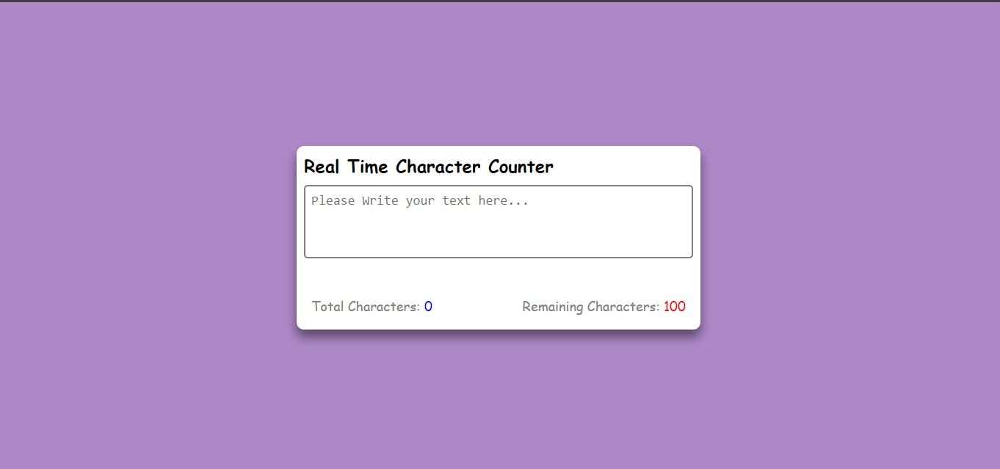
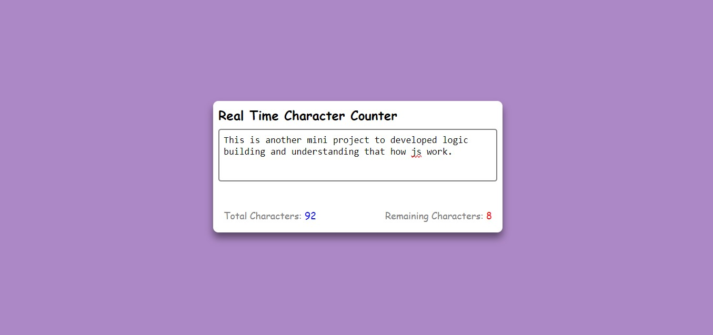

# Real Time Character Counter

I have developed a project called **Real-time Character Counter** using JavaScript, HTML, and CSS. The application dynamically counts the number of characters entered as the user types. It also enforces an upper limit on the number of characters allowed. Once the user reaches this limit, no additional characters can be input. This project serves as a practical example of how real-world applications work by enforcing constraints and providing instant feedback to the user.

 
